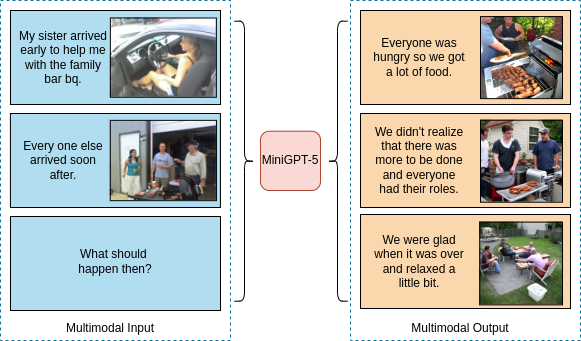
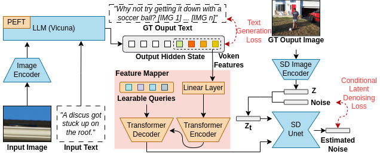

# MiniGPT-5: Interleaved Vision-and-Language Generation via Generative Vokens
[Kaizhi Zheng](https://kzzheng.github.io/)* , [Xuehai He](https://scholar.google.com/citations?user=kDzxOzUAAAAJ&hl=en)* , [Xin Eric Wang](https://eric-xw.github.io/) 

University of California, Santa Cruz

<a href='https://arxiv.org/abs/2310.02239'></a>



Large Language Models (LLMs) have garnered significant attention for their advancements in natural language processing, demonstrating unparalleled prowess in text comprehension and generation. Yet, the simultaneous generation of images with coherent textual narratives remains an evolving frontier. In response, we introduce an innovative interleaved vision-and-language generation technique anchored by the concept of ``generative vokens", acting as the bridge for harmonized image-text outputs. Our approach is characterized by a distinctive two-staged training strategy focusing on description-free multimodal generation, where the training requires no comprehensive descriptions of images.  To bolster model integrity, classifier-free guidance is incorporated, enhancing the effectiveness of vokens on image generation. Our model, MiniGPT-5, exhibits substantial improvement over the baseline Divter model on the MMDialog dataset and consistently delivers superior or comparable multimodal outputs in human evaluations on the VIST dataset, highlighting its efficacy across diverse benchmarks.

## Model Architecture


## Getting Started
### Installation

**1. Download repo and create environment**

Clone our repo and create a new python environment.

```bash
git clone https://github.com/eric-ai-lab/MiniGPT-5.git
cd MiniGPT-5
conda create -n minigpt5 python=3.9
conda activate minigpt5
pip install -r requirements.txt
```

**2. Prepare the pretrained weights**

Our model is based on the pretrained [MiniGPT-4](https://github.com/Vision-CAIR/MiniGPT-4) (inluding [Vicuna](https://github.com/lm-sys/FastChat) and [BLIP-2](https://github.com/salesforce/LAVIS)). Please download [Vicuna V0 7B](https://huggingface.co/Vision-CAIR/vicuna-7b/tree/main) weights. Then, set the path to the vicuna weight in the [model config file](minigpt4/configs/models/minigpt4.yaml#L16) at Line 16.

Since the Pretrained MiniGPT-4 Aligned Checkpoint is small, we already download in config folder, and the model path is set in [config file](config/minigpt4.yaml#10) at Line 10.

**3. Download MiniGPT-5 Checkpoint**

Since our model is trained with two stages **(Stage 1: Unimodal Alignment Stage, Stage 2: Multimodal Learning Stage)**, we provide both two-stage checkpoints here:

|                                          Stage 1: CC3M                                           |                                          Stage 2: VIST                                          |                            Stage 2: MMDialog                             |
:------------------------------------------------------------------------------------------------:|:----------------------------------------------------------------------------------------------:|:----------------------------------------------------------------------------------------------:
 [Downlad](https://drive.google.com/file/d/1y-VUXubIzFe0iq5_CJUaE3HKhlrdn4n2/view?usp=sharing) | [Download](https://drive.google.com/file/d/1rjTsKwF8_pqcNLbdZdurqZLSpKoo2K9F/view?usp=drive_link) | [Download](https://drive.google.com/file/d/1ehyX8Ykn1pbU5J8yM47catSswId0m5FZ/view?usp=drive_link)

Stage 2 needs the pretrained weights in Stage 1, so always download Stage 1 weights first. 

Please download these weights into a single folder, and we will call this folder as ***WEIGHT_FOLDER*** in the following sections.

### Demo
We provide a [python file](examples/playground.py) to try our model. This file will generate multimodal outputs under the [example folder](examples/) by taking a two-turn multimodal inputs.

```bash
cd examples
export IS_STAGE2=True
python3 playground.py --stage1_weight WEIGHT_FOLDER/stage1_cc3m.ckpt 
                        --test_weight WEIGHT_FOLDER/stage2_vist.ckpt
```

### Evaluation
Our model evaluate on three datasets: [CC3M](https://ai.google.com/research/ConceptualCaptions/download), [VIST](https://visionandlanguage.net/VIST/), and [MMDialog](https://github.com/victorsungo/MMDialog). Due to the license, we only share some dataset examples under the [datasets](datasets/) folder. If you want to fully test the performance, please download the full dataset and format into the same data structures under the [datasets](datasets/) folder.

**1. Stage 1: Unimodal Alignment Stage (CC3M) evaluation**

During this stage, the goal is to generate correct images by giving image descriptions.

Generation (If you have more than one gpus, you can set gpus to 0,1,2...):
```bash
export IS_STAGE2=False
export WEIGHTFOLDER=WEIGHT_FOLDER
export DATAFOLDER=datasets/CC3M
export OUTPUT_FOLDER=outputs
python3 train_eval.py --test_data_path cc3m_val.tsv 
                        --test_weight stage1_cc3m.ckpt
                        --gpus 0
```

Calculate Metric:
```bash
export CC3M_FOLDER=datasets/CC3M
python3 metric.py --test_weight stage1_cc3m.ckpt
```

**2. Stage 2: Multimodal Learning Stage (VIST) evaluation**

Model will take the previous multimodal story sequences and generate either unimodal or multimodal outputs. Here, the default code is about multimodal input & image generation. To test other settings, please remove the *not test* condition in [Line 280](dataloader.py#280).

Generation:
```bash
export IS_STAGE2=True
export WEIGHTFOLDER=WEIGHT_FOLDER
export DATAFOLDER=datasets/VIST
export OUTPUT_FOLDER=outputs
python3 train_eval.py --test_data_path val_cleaned.json 
                        --test_weight stage2_vist.ckpt
                        --stage1_weight stage1_cc3m.ckpt
                        --gpus 0
```

Calculate Metric:
```bash
python3 metric.py --test_weight stage2_vist.ckpt
```

**3. Stage 2: Multimodal Learning Stage (MMDialog) evaluation**

Model will take previous turn multimodal inputs and generate multimodal response for multimodal conversations.

Generation:
```bash
export IS_STAGE2=True
export WEIGHTFOLDER=WEIGHT_FOLDER
export DATAFOLDER=datasets/MMDialog
export OUTPUT_FOLDER=outputs
python3 train_eval.py --test_data_path test/test_conversations.txt 
                        --test_weight stage2_mmdialog.ckpt
                        --stage1_weight stage1_cc3m.ckpt
                        --gpus 0
```

Calculate Metric:
```bash
python3 metric.py --test_weight stage2_mmdialog.ckpt
```

### Training

**1. Stage 1 training**

Download the CC3M dataset and format into the same data structure in dataset folder.

Then, we use test data as example:
```bash
export IS_STAGE2=False
export WEIGHTFOLDER=WEIGHT_FOLDER
export DATAFOLDER=datasets/CC3M
python3 train_eval.py --is_training True
                        --train_data_path cc3m_val.tsv
                        --val_data_path cc3m_val.tsv
                        --model_save_name stage1_cc3m_{epoch}-{step}
                        --gpus 0
```

**2. Stage 2 training**

Download the VIST or MMDialog datasets and format into the same data structure in dataset folder.

Here we use VIST test data as example:
```bash
export IS_STAGE2=True
export WEIGHTFOLDER=WEIGHT_FOLDER
export DATAFOLDER=datasets/VIST
python3 train_eval.py --is_training True
                        --train_data_path val_cleaned.json
                        --val_data_path val_cleaned.json
                        --stage1_weight stage1_cc3m.ckpt
                        --model_save_name stage2_vist_{epoch}-{step}
                        --gpus 0
```

## If you find MiniGPT-5 useful in your research or applications, please cite as below:
```bibtex
@misc{zheng2023minigpt5,
      title={MiniGPT-5: Interleaved Vision-and-Language Generation via Generative Vokens}, 
      author={Kaizhi Zheng and Xuehai He and Xin Eric Wang},
      year={2023},
      journal={arXiv preprint arXiv:2310.02239}
}
```
